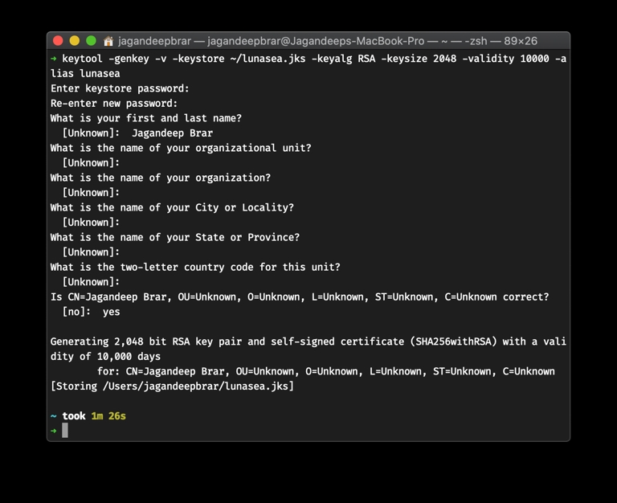
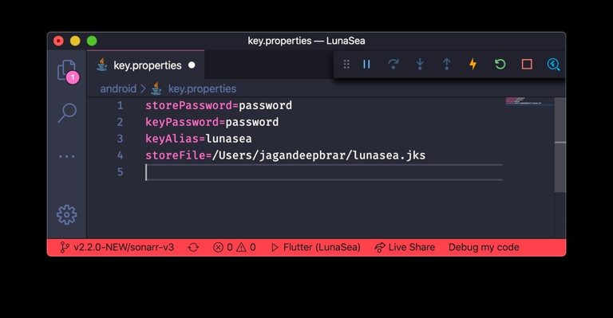

# Android Keystore

In order to create production builds for LunaSea-ng, you must first create and sign the release using the [Android Keystore System](https://developer.android.com/training/articles/keystore "Android Keystore System").

## Create a Keystore

Open a terminal window and run the following command to generate a new Android keystore:

``` bash
keytool -genkey -v -keystore ~/key.jks -keyalg RSA -keysize 2048 -validity 10000 -alias lunasea
```
You can optionally change the following:

1. `-keystore ~/key.jks`: By default this will create the new keystore in the home directory of the running user as the file `key.jks` but this can be changed to any location you like.
2. `-alias lunasea`: By default the keystore internal alias is set to lunasea but you can use any alias you like.

The generation will ask you for some basic information including a password. Please ensure you do not forget this password because you will need it in the next step.



## Add the Keystore Information to LunaSea-ng

In the root of the project, enter the `android` folder and copy your previously generated `*.jks` keystone into this folder, and name it `key.jks`.

In the same folder, open` key.properties.sample`. Fill in all of the fields with the following information:
1. `storePassword`: Password from step 1
2. `keyPassword`: Same password from step 1
3. `keyAlias`: The chosen alias from step 1
4. `storeFile`: Keep it as ../key.jks

Save the file as `key.properties` inside of `<project root>/android`.



And that's it! You are ready to create production releases of LunaSea-ng using your own signing keystore.