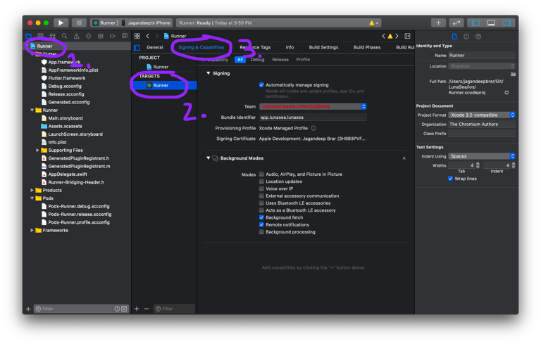
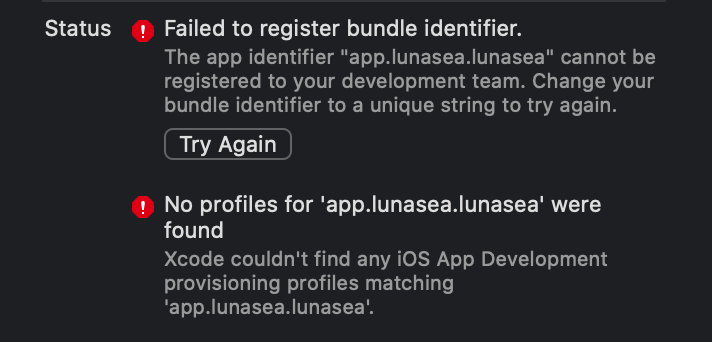
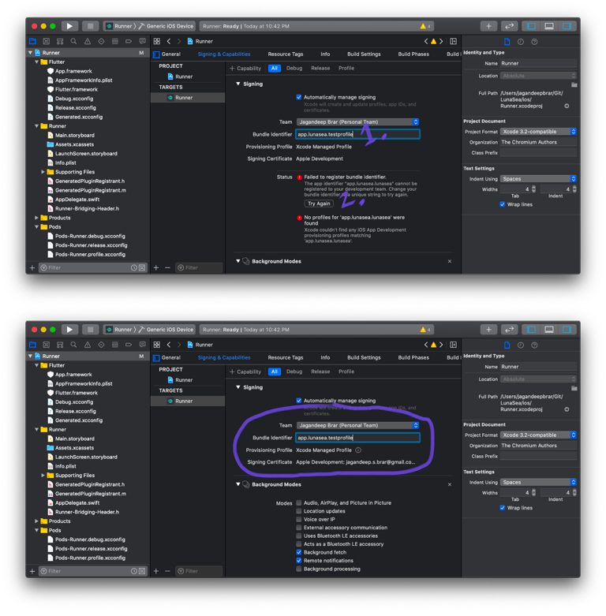

# macOS Development Certificate

In order to create any build for LunaSea, you must first create and attach a [Development Certificate](https://developer.apple.com/support/certificates/ "Development Certificate") to the XCode project.

## Preparing the Project

In the root of the project, enter the `macos` folder and open `Runner.xcworkspace` in XCode.

1. Select `Runner` in the lefthand navigation pane.
2. Under `Targets` select `Runner`.
3. Select the `Signing & Capabilities` tab.

## Creating a Signing Team

1. Under `Signing` select the dropdown for the team (Should currently be `Unknown Name (<<My Team ID>>)`).
2. Add an account (your Apple ID) and select your name or if already added then simply select your name.
3. The status should show `Failed to register bundle identifier` because the bundle identifier needs to be unique for each profile.

## Creating a Bundle Identifier and Signing Profile

1. Enter a **unique** bundle identifier (this does not need to resemble the current bundle identifier, it can be anything you want, but should follow the format of `<word>.<word>.<word>`, so for example I have used `app.lunasea.testprofile`.
2. Once you enter a unique bundle identifier, hit "Try again" to fetch a new signing profile for this bundle identifier. You will see the `Apple Development: <Your email>` if you successfully created a signing profile.

And that's it! You are ready to create builds of LunaSea using your own signing profile.

> If you are using a free developer certificate then the application will remain valid for 7 days on a device. A paid developer certificate allows the application to remain valid for 365 days on a device.